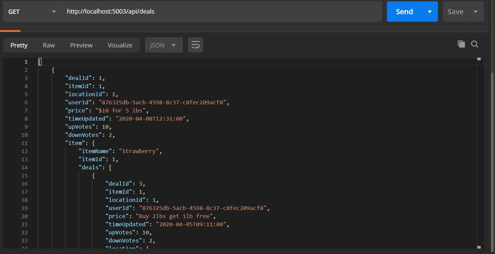
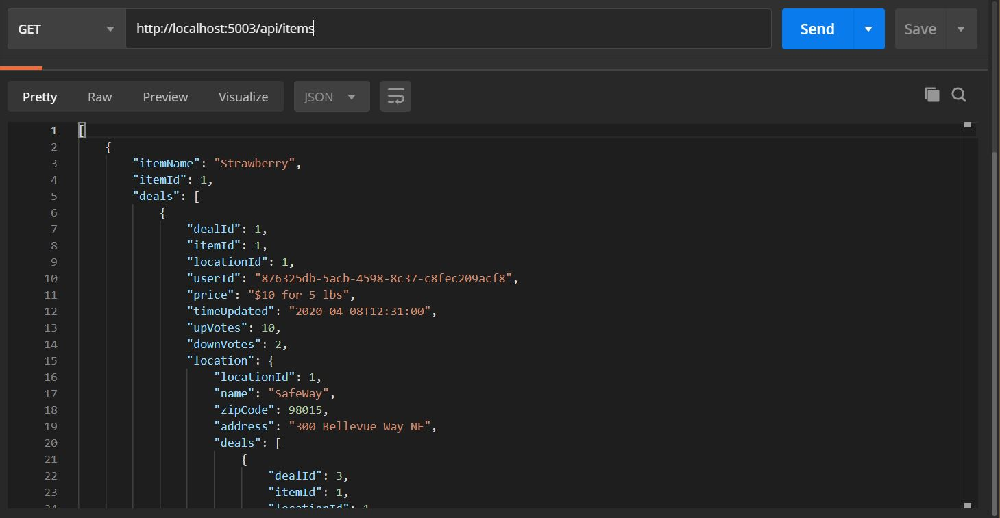
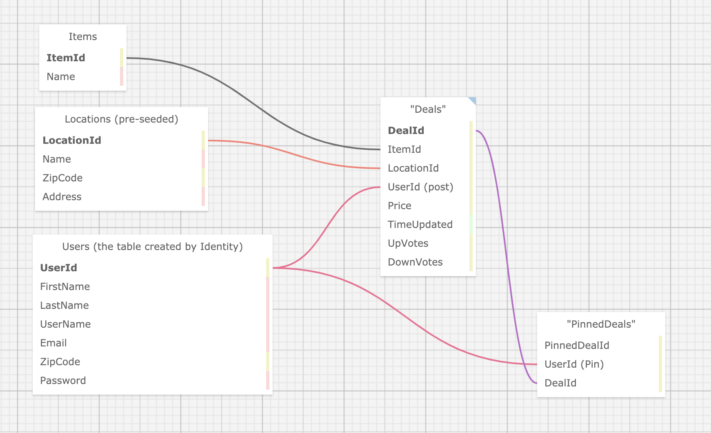
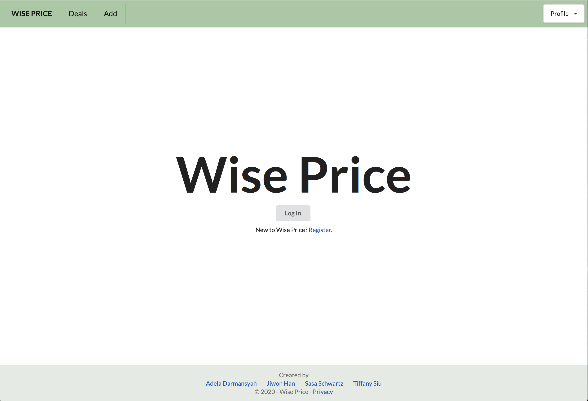
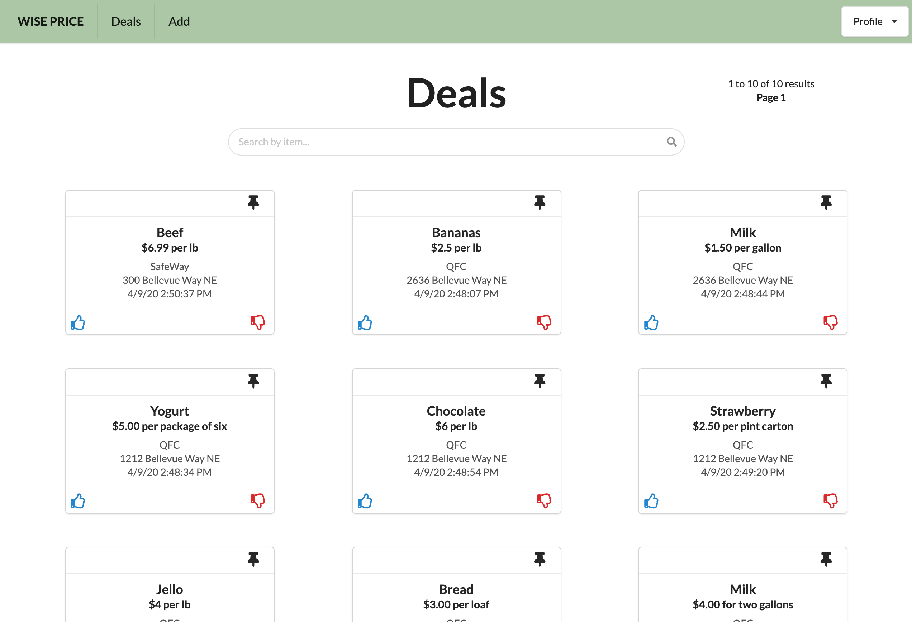

# Wise Price API and MVC Application

#### Team Week C# Project for Epicodus. Built API and MVC applications for a community to share grocery deals.

#### Current version: 04.09.20

#### By Sarah "Sasa" Schwartz, Adela Darmansyah, Tiffany Siu, Jiwon Han

<!-- [](https://www.repostatus.org/#wip) -->

[](https://www.repostatus.org/#inactive)


[](https://lbesson.mit-license.org/)

---

## Wise Price API: Table of Contents

1. [API Description](#api-description)
2. [API Setup/Installation Requirements](#api-setup)
3. [API Documentaion](#api-documentation)
4. [API Known Bugs](#api-known-bugs)
5. [API Screenshots](#api-screenshots)

## Wise Price MVC Application: Table of Contents

1. [MVC Description](#mvc-description)
2. [MVC Setup/Installation Requirements](#mvc-setup)
3. [MVC Specifications](#specifications)
4. [MVC Known Bugs](#mvc-known-bugs)
5. [MVC Screenshots](#mvc-screenshots)

## Miscellaneous

1. [Work Distribution](#work-distribution)
2. [Improvement Opportunities](#improvement-opportunities)
3. [Technologies Used](#technologies-used)
4. [Support and Contact Details](#support-and-contact-details)
5. [License](#license)

---

## API Description

A C#/.NET Core API that hosts information on grocery locations, items, deals and users. This API provides full CRUD functionality, allowing users to create, view, edit, and delete grocery deals, store locations, grocery items and users.

## API Setup

To run dev mode locally:

```bash
  $ git clone
  $ cd WisePrice
  $ dotnet add package Microsoft.EntityFrameworkCore -v 2.2.0
  $ dotnet add package Pomelo.EntityFrameworkCore.MySql -v 2.2.0
  $ dotnet add package Microsoft.EntityFrameworkCore.Proxies -v 2.2.0
  $ dotnet add package Microsoft.AspNet.Identity.EntityFramework --version 2.2.3
  $ dotnet add package --version 5.3.1 Swashbuckle.AspNetCore
  $ dotnet add package Microsoft.AspNet.Identity
  $ dotnet build
  $ dotnet ef migrations add MigrationName
  $ dotnet ef database update
  # After successfull pkg installtion
  $ dotnet run
```

Now, it will automatically open http://localhost:5003 and API is available on [Postman](https://www.postman.com/) or [Swagger UI](https://localhost:5003/swagger)


> **If you receive an error during this stage, check to make sure the password in `appsettings.json` matches your personal MySQL password.

## API Documentation

- Base url: http://localhost:5003/
- View all API endpoints using Swagger: http://localhost:5003/swagger or see [API Endpoints](#api-endpoints) below.

#### API Endpoints

<details>
  <summary>DEALS</summary>

| Action for DEALS           | Method | Endpoint                     | Query Parameters                                    | Raw JSON Body Input                                                                                                                             |
| :------------------------- | :----- | :--------------------------- | :-------------------------------------------------- | :---------------------------------------------------------------------------------------------------------------------------------------------- |
| List all deals (paginated) | GET    | /api/deals                   | string itemName, string zipCode, int page, int size | N/A                                                                                                                                             |
| Retrieve specific deal     | GET    | /api/deals/{id}              | N/A                                                 | N/A                                                                                                                                             |
| Create deal\*              | POST   | /api/deals                   | N/A                                                 | { "itemId": #, "locationId": #, "userId": #, "price": "[specify-price-here]", "upVotes": #, "downVotes": # }                                    |
| Edit deal                  | PUT    | /api/deals/{id}              | N/A                                                 | { "itemId": #, "locationId": #, "userId": #, "price": "[specify-price-here]", "timeUpdated": "YYYY-MM-DD HH:MM", "upVotes": #, "downVotes": # } |
| Delete deal\*\*            | DELETE | /api/deals/{userId}/{dealId} | N/A                                                 | N/A                                                                                                                                             |
| Count all deals            | GET    | /api/deals/count             | string itemName, string locationName                | N/A                                                                                                                                             |

> \*Creating a new deal will automatically create a PostedDeal relationship given a userId in JSON input.
> \*\*Deleting a deal will automatically delete its PostedDeal.

</details>

<details>
  <summary>ITEMS</summary>
  
| Action for ITEMS                 | Method | Endpoint          | Query Parameters | Raw JSON Body Input |
| :------------------------------- | :----- | :---------------- | :--------------- | :------------------ |
| List all items* (paginated)      | GET    | /api/items        | string name, int page, int size | N/A |
| Retrieve specific location       | GET    | /api/locations/{id}   | N/A | N/A |
| Create item                      | POST   | /api/items        | N/A | { "ItemName": "[item name]" } |
| Edit item                        | PUT    | /api/items/{id}   | N/A | { "ItemName": "[edited item name]" } |
| Delete item                      | DELETE | /api/items/{id}   | N/A | N/A |
| Count all items                  | GET    | /api/items/count  | N/A | N/A |

</details>

<details>
  <summary>LOCATIONS</summary>

| Action for LOCATIONS                    | Method | Endpoint                    | Query Parameters                                                | Raw JSON Body Input                  |
| :-------------------------------------- | :----- | :-------------------------- | :-------------------------------------------------------------- | :----------------------------------- |
| List all locations\* (paginated)        | GET    | /api/locations              | string name, string zipcode, string address, int page, int size | N/A                                  |
| Retrieve specific location              | GET    | /api/locations/{id}         | N/A                                                             | N/A                                  |
| Create location                         | POST   | /api/locations              | N/A                                                             | { "Name": "[location name]" }        |
| Edit location                           | PUT    | /api/locations/{id}         | N/A                                                             | { "Name": "[edited location name]" } |
| Delete location                         | DELETE | /api/locations/{id}         | N/A                                                             | N/A                                  |
| Count all locations                     | GET    | /api/locations/count        | N/A                                                             | N/A                                  |
| Retrieve locations in specific zip code | GET    | api/locations/neareststores | int userZipCode                                                 | N/A                                  |

</details>

<details>
  <summary>USERS</summary>

| Action for USERS | Method | Endpoint        | Query Parameters | Raw JSON Body Input |
| :--------------- | :----- | :-------------- | :--------------- | :------------------ |
| Retrieve a user  | GET    | /api/users/{id} | N/A              | N/A                 |
| Delete a user    | DELETE | /api/users/{id} | N/A              | N/A                 |
| Create a user    | POST   | /api/users      | N/A              | { "UserId": # }     |

> USER does NOT have a PUT method as UserId cannot be edited (due to it being a Primary Key).

</details>

<details>
  <summary>PINNED DEALS</summary>

| Action for PINNED DEALS                                      | Method | Endpoint                           | Query Parameters   | Raw JSON Body Input                                 |
| :----------------------------------------------------------- | :----- | :--------------------------------- | :----------------- | :-------------------------------------------------- |
| List all pinned deals sorted by item name (paginated)\*      | GET    | /api/pinneddeals/{userId}          | int page, int size | N/A                                                 |
| Retrieve specific pinned deal                                | GET    | /api/pinneddeals/{userId}/{dealId} | N/A                | N/A                                                 |
| Create pinned deal and doensn't allow duplicated pinned deal | POST   | /api/posteddeals                   | N/A                | { "userId": "[User Id]" } { "dealId": "[Deal Id]" } |
| Delete pinned deal                                           | DELETE | /api/pinneddeals/{userId}/{dealId} | N/A                | N/A                                                 |
| Count all pinneddeals                                        | GET    | /api/pinneddeals/{userId}/count    | N/A                | N/A                                                 |

> PINNED DEALS do not have a PUT method as when a user pins/unpins a deal, the user creates/deletes a PinnedDeal relationship.

</details>

<details>
  <summary>POSTED DEALS</summary>

| Action for POSTED DEALS             | Method | Endpoint                           | Query Parameters   | Raw JSON Body Input          |
| :---------------------------------- | :----- | :--------------------------------- | :----------------- | :--------------------------- |
| List all posted deals (paginated)\* | GET    | /api/posteddeals/{userId}          | int page, int size | N/A                          |
| Retrieve specific posted deal       | GET    | /api/posteddeals/{userId}/{dealId} | N/A                | N/A                          |
| Create posted deal relationship\*   | POST   | /api/posteddeals/{userId}          | N/A                | { "userId": 1, "dealId": 2 } |
| Delete posted deal\*\*              | DELETE | N/A                                | N/A                | N/A                          |
| Count all posted deals of a user    | GET    | /api/posteddeals/{userId}/count    | N/A                | N/A                          |

> \*There are 2 ways you can create a new PostedDeal: 1) By creating a new deal will automatically create a new PostedDeal. 2) By creating a new PostedDeal directly.
> \*\*See DELETE action for DEALS.
> POSTED DEALS do not have a PUT method as when a user edits a deal, the userId and dealId will not change therefore the PostedDealId will not change.

</details>

<details>
  <summary>Examples</summary>

#### Examples of Query Search

| Parameter | Type   | Example                                             | Response                                             |
| :-------- | :----- | :-------------------------------------------------- | :--------------------------------------------------- |
| Name      | String | http://localhost:5003/api/deals?itemname="broccoli" | Deals with name "broccoli"                           |
| Location  | String | http://localhost:5003/api/deals?zipcode="98105"     | Deals offered in the area of "98105"                 |
| Page      | Int    | http://localhost:5003/api/deals?page=2              | Page 2 of paginated deal results (default is page 1) |
| Size      | Int    | http://localhost:5003/api/deals?size=25             | 25 deals per page (default is 20 and max is 50)      |

</details>

#### Pagination

<details>
<summary>Click to expand!</summary>

- This API returns paginated results, with a default page size of 20 results per page and a max page size of 40 results per page.
- The default page number is set to 1.
- See the [search parameters](#search-parameters) above for information on how to adjust page size and number.
- Example query: http://localhost:5003/api/deals/?itemname=broccoli&zipcode=98105&page=3&size=25
  - This query returns deals for the item broccoli in the area near 98105. It starts at page 3 with 25 results per page.

</details>

## API Known Bugs

- Create a new pinned deal join entity works. However, unable to link the functionality to the MVC application.
- List of all deals do not have sorting by time updated functionality.
- All search queries work. However, unable to link the functionality to the MVC application.

## API Screenshots

Get all deals in Postman:



Get all items in Postman:



---

## MVC Description

An MVC web application that enables a community to share grocery deals. Our website has full CRUD functionality via our API application, allowing users to create, view, edit, and delete grocery deals. A user can register for an account, log in and out, and view their account details. A user can see all the deals they have posted, as well as pin deals they want to save for later.

## MVC Setup

- Clone the repository on Github
- Open the terminal on your desktop
- \$ git clone "insert your cloned URL here"
- Change directory to the WisePriceClient directory, within the WisePrice.Solution directory
- \$ dotnet restore
- Recreate the database structure with migration:
  - \$dotnet ef migrations add Initial
  - \$dotnet ef database update
  - If you receive an error during this stage, check to make sure the password in "appsettings.json" matches your personal MySQL password
- \$ dotnet run (runs the server at localhost:5000)
- Call this API with your web application or test out the requests using Postman.

## Specifications

<details>
  <summary>MVP UI design - click to expand!</summary>

  

</details>

<details>
  <summary>Initial Database Design - click to expand!</summary>

  

</details>

### MVP Specs

- As a user, I want to be able to share a deal for a specific item at a specific store.
  - Sample input: User fills out and submits "add deal" form
  - Expected output: Deal is added to list of deals for all users
- As a user, I want to be able to add an item if the one I'm looking for is not already present.
  - Sample input: User fills out deal form, but cannot find their item and clicks "don't see your item?"
  - Expected output: Additional form field appears, allowing user to add a new item for their deal
- As a user, I want to be able to edit deals I have posted.
  - Sample input: User edits the milk deal posted on today and clicks edit button
  - Expected output: Milk price is edited from $2 to $1.50
- As a user, I want to be able to delete deals I have posted.
  - Sample input: User delete the egg deal posted on yesterday and clicks delete button
  - Expected output: The post is deleted
- As a user, I want to be able to pin deals I want to save.
  - Sample input: User clicks the "pin" button on a deal while browsing
  - Expected output: That deal is added to user's "pinned deals" list
- As a user, I want to be able to browse through deals.
  - Sample input: User clicks the "deals" button
  - Expected output: A list of deals is presented to the user to scroll through
- As a user, I want to be able to register for an account on Wise Price.
- As a user, I want to be able to log into and out of my account on Wise Price.
- As a developer, I want to notify the user about the privacy policy prior to them logging on.
- As a developer, I want the website to have a navigation bar at the top and footer at the bottom.

### Future Specs

<details>
  <summary>Click to expand!</summary>

- As a user, I want to be able to remove deals I have pinned.
- As a user, I want to see how recently each deal was posted/updated.
- As a user, I want to view deals sorted by how close they are to my inputted location.
- As a user, I want to view deals sorted by how recently they were posted.
- As a user, I want to be able to "like" or vote up a deal that I like.
- As a user, I want to be able to "dislike" or vote down a deal that I dislike.
- As a user, I want to be able to see the overall vote percentage for another user to know if their deals are trustworthy.
- As a user, I want to add items per category.
- As an admin, I want to be able to view and manage all member accounts.
- As a developer, I want to be able to launch a live demo of the application.
- As a user, I want to be able to change my password.

</details>

## MVC Known Bugs

- Adding new items that are not in the drop down does not have functionality written
- Pagination does not have functionality written
- Navigating to "My Pinned Deals" or "Posted Deals" when not logged in throws an exception
- Voting up/down for deals does not have functionality
- Clicking Push pins on deals does not have working functionality of adding deals to "My Pinned Deals"

## MVC Screenshots

The Homepage:



Here's an example of the Deals Index:



---

## Work Distribution

- Sasa Schwartz
  - Front End
  - Project Manager
- Adela Darmansyah
  - Full Stack
  - Scrum Master
- Tiffany Siu
  - Full Stack
  - Scrum Master
- Jiwon Han
  - Back-end
  - Database management

<a href="https://github.com/seschwartz8/WisePrice.Solution/graphs/contributors">
  
</a>

Made with [contributors-img](https://contributors-img.web.app).

## Improvement Opportunities

- Ability to remove deals that have been pinned
- View how recently deals were posted/update from now
- Sort all deals by how close they are to inputted location or how recently they were posted
- Ability to vote deals up or down and see the overall vote approval percentage for another user to know if their deals are trustworthy
- Add items with an asssociated category
- Ability to add new locations
- Show deals in sections by location
- Ability to change password
- Add log out button to account drop down
- Points of interest API functionality to view/search for stores on a map
- Ability for users to comment on deals
- Pictures of items showing with the chosen item when adding a deal and on deal cards
- Function to send daily texts/emails on relevant deals for users
- Get actual prices for comparison from real store databases
- Add live demo for project

## Technologies Used

- C#
- [.NET CORE](https://dotnet.microsoft.com/download/dotnet-core/)
- Entity Framework and Razor
- [MySQL](https://dev.mysql.com/downloads/file/?id=484919)
- [Semantic UI](https://semantic-ui.com/)
- [Swagger](https://www.c-sharpcorner.com/article/how-to-use-swagger-with-asp-net-core-web-apis/)
- [Pagination](https://www.carlrippon.com/scalable-and-performant-asp-net-core-web-apis-paging/)

## Support and Contact Details

_If there are any question or concerns please contact us at our emails: [Sasa Schwartz](mailto:#), [Adela Darmansyah](mailto:adela.yohana@gmail.com), [Tiffany Siu](mailto:tsiu88@gmail.com), and [Jiwon Han](mailto:#jiwon1.han@gmail.com). Thank you._

### License

- This software is licensed under the MIT license.

Copyright (c) 2020 **_Sasa Schwartz, Adela Darmansyah, Tiffany Siu, Jiwon Han_**
